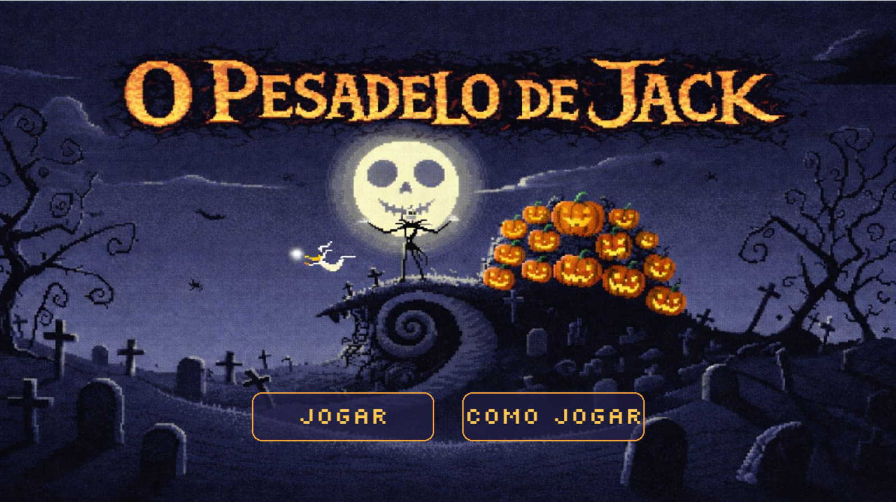
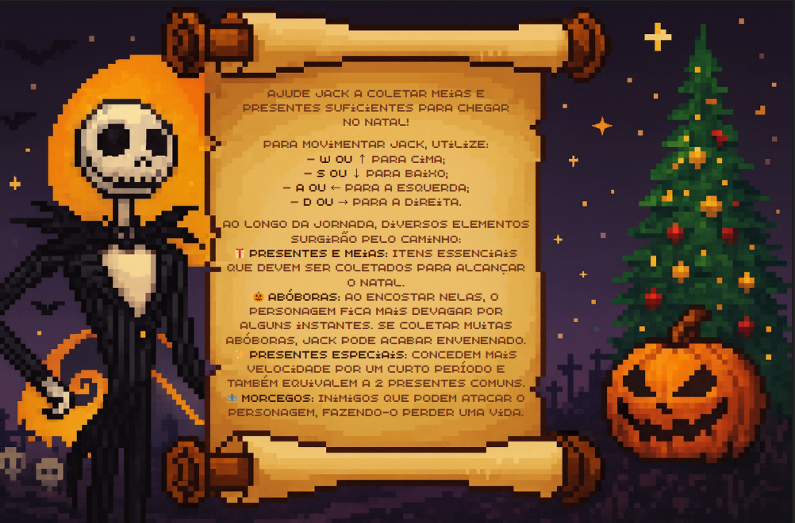
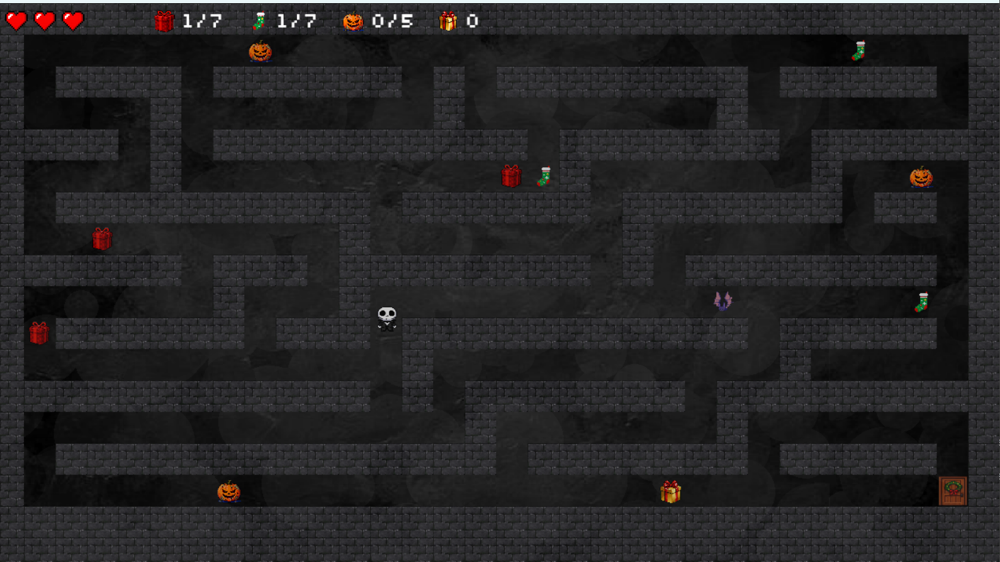

# O Pesadelo de Jack
## Descrição Geral do Projeto
O Pesadelo de Jack é um jogo 2D inspirado no filme O Estranho Mundo de Jack, dirigido por Tim Burton. A narrativa acompanha Jack Skellington, o Rei das Abóboras, que ao sair de sua cidade descobre a Cidade do Natal. 
No jogo, o personagem precisa encontrar seu próprio caminho até o Natal, enfrentando diferentes rotas que nem sempre são corretas ou até mesmo seguras. Dessa forma, o jogador é desafiado a tomar decisões estratégicas enquanto explora um cenário que mescla elementos sombrios do Halloween com aspectos característicos do Natal. Todo o ambiente visual foi cuidadosamente inspirado no filme, preservando a identidade estética e realizando uma transição gradual para elementos natalinos.
Este projeto foi desenvolvido como um dos requisitos para a conclusão da disciplina Introdução à Programação. Para conclusão eficiente do trabalho foi utilizado a biblioteca Pygame e os principais conceitos abordados ao longo da disciplina, como lógica de programação, estruturação de código e programação orientada a objetos.

---
## Integrantes da Equipe

  - Ana Clara Souza Bizarria <acsb2>
  - Byanca Haially Candido de Souza <bhcs>
  - Jaianny Karla de Oliveira Souza <jkos>
  - Maria Cláudia Silva Rocha <mcsr>
  - Raiana Laís Pereira Donato <rlpd>
  - Samara Petrilly de Arruda Barbosa <spab>

---
## Divisão de Trabalho

| Membro                         | Responsabilidades                                                                 |
|--------------------------------|-----------------------------------------------------------------------------------|
| Ana Clara S. Bizarria          | Estrutura do código, documentação, organização da equipe e GitHub, relatório, apoio ao design e sonoplastia |
| Byanca Hayally C. Souza        | Mecânicas dos elementos, sistema de pontuação, interface e apoio à documentação   |
| Jaianny Karla O. Souza         | Design de personagens e elementos, mecânicas, organização do GitHub, documentação e sonoplastia |
| Maria Cláudia S. Rocha         | Estrutura do código, documentação, README, sonoplastia e apoio ao design dos cenários |
| Raiana Laís P. Donato          | Design de cenários e personagens, mecânicas e apoio à documentação                |
| Samara Petrilly A. Barbosa     | Mecânicas dos elementos, sistema de pontuação, interface e apoio à documentação   |


---

## Arquitetura do Projeto
```
JOGO-IP/
├── assets/                       		# Pasta original de recursos (imagens, sons)
├── src/                          		# Código-fonte organizado
│   ├── enemies/                  		# Submódulo de inimigos
│   │   ├── __init__.py          	    # Pasta de iniciação do python
│   │   └── morcego.py           	    # Classe do morcego
│   ├── items/                    		# Personagens e objetos e seus recursos
│   │   ├── __init__.py           	  # Pasta de iniciação do python
│   │   ├── aboboraEstratada.py   	  # Classe abóbora estragada
│   │   ├── itens.py              		# Classe dos itens coletáveis
│   │   ├── meia.py              		  # Classe da meia
│   │   ├── presente.py           	  # Classe do presente
│   │   └── presenteEspecial.py  	    # Classe do presente especial
│   ├── cenarios.py               	  # Classe que define a tela geral
│   ├── efeitos.py                		# Classe dos efeitos especiais
│   ├── jogador.py                	  # Classe do jogador
│   ├── jogo.py                  		  # Classe do jogo, onde está a lógica principal
│   ├── labirinto.py              		# Classe do labirinto
│   └── sonoplastia.py            	  # Sistema de áudio
├── .gitignore                   		  # Ignorar __pycache__ e arquivos de sistema
└── main.py                       		# Arquivo que inicia tudo
```

---

## Capturas de Tela
### Tela Inicial:


### Como Jogar:


### Labirinto:


### Tela vitória:


### Tela game over:


## Ferramentas e Justificativas

Para o desenvolvimento de O Pesadelo de Jack, foram utilizadas diversas ferramentas que em conjunto tornaram possível os cenários, funcionamento e a sonoplastia aplicados. São essas: 

- **Python**: linguagem de programação utilizada para construção de todo o projeto, desde a implementação de classes até a integração com outras bibliotecas utilizadas; 
- **Pygame**: biblioteca python utilizada para carregamento e manipulação de imagens, captura de eventos do teclado para interações no jogo e reprodução de efeitos sonoros; 
- **Visual Studio Code**: ambiente de desenvolvimento utilizado pela equipe pela fácil adaptação, além de garantir fácil integração com o gitHub; 
- **GitHub**: utilizado para hospedagem do código fonte, controle de versões e colaboração da equipe; 
- **Trello**: ambiente de organização do projeto, utilizado para distribuir e rastrear as responsabilidades individuais e em equipe; 
- **Google Drive**: organização e visualização fácil dos requisitos gerais do projeto, armazenamento de links úteis e materiais de estudo; 
- **Discord e WhatsApp**: principais sistemas de comunicação com a monitoria e em equipe respectivamente.

---

## Conceitos Utilizados na Disciplina

- **Comandos condicionais**: ``[if, elif, else]`` foram fundamentais para definir casos e aplicar condições específicas em que o personagem se encontra durante o percorrer do jogo, como aplicar condições de colisão com o inimigo, além de definir a sua própria movimentação ao receber os comandos do teclado;

- **Estruturas de laços de repetição**: ``[for e while]`` garantiram o loop de execução do jogo até que a condição de encerramento foi atingida;

- **Funções**: definiram as principais rotinas do jogo, ou seja, todas as ações que se repetiam com frequência. Dessa maneira foi possível atualizar o estado do personagem com muito mais facilidade. 

- **Programação orientada à objetos**: utilizada de forma essencial para uma boa modularização do projeto. Garantiu que cada classe fosse criada para representar entidades como o jogador, inimigos e elementos de cenário, encapsulando seus atributos e comportamentos e permitindo instanciá-los quando necessário.

---

## Desafios, Erros e Lições Aprendidas

**Qual foi o maior erro cometido durante o projeto? Como vocês lidaram com ele?**  
O maior erro cometido durante o desenvolvimento de O Pesadelo de Jack ocorreu nas etapas iniciais - a equipe não conseguiu determinar com antecedência o que seria feito e qual seria a fonte de inspiração. Atrelado a isso, não houve critérios bem definidos para avaliar se a ideia planejada era viável ou não dentro do tempo estipulado para a construção. A equipe tomou a decisão de solicitar auxílio aos monitores designados para melhores orientações do que seria possível ser realizado para que nenhuma etapa fosse priorizada de maneira equivocada e, dessa forma, todos os requisitos fossem cumpridos com eficiência.

**Qual foi o maior desafio enfrentado durante o projeto? Como vocês lidaram com ele?**  
O maior desafio enfrentado pela equipe foi lidar com o versionamento de código. Não havia experiência prévia da maior parte das integrantes com o gitHub e isso dificultou com que o versionamento fosse efetuado da melhor maneira possível. Contudo, através de organização prévia e documentação do projeto a equipe conseguiu estudar o suficiente para desenvolver o projeto superando o problema e atingindo uma boa estrutura e organização, desse modo, todas puderam colaborar ativamente

**Quais as lições aprendidas durante o projeto?**  
Durante o desenvolvimento a equipe lidou com contratempos - isso deixou perceptível que ter construído uma documentação prévia do projeto e feito uma boa distribuição de tarefas possibilitou que todas as integrantes pudessem se organizar à sua maneira para poder realizar as tarefas dentro dos prazos estipulados; A comunicação eficiente também tornou possível que todas pudessem estudar a principal biblioteca e plataforma para conseguir colaborar com a equipe e no desenvolvimento do código fonte. Por fim, no panorama geral, a equipe conseguiu colocar em prática conceitos aprendidos em sala de aula num projeto maior, conhecer e aplicar programação orientada a objetos, colaborar em equipe e manter uma comunicação constante.

---

## Instruções de Execução

1. Clone o repositório:
```bash
git clone https://github.com/jaikarla/jogo-ip.git
```

2. Instale as dependências:
```bash
pip install pygame
```

3. Execute o jogo:
```bash
python jogo.py
```

---

## Controles

| Ação                  | Jack                        | 
|-----------------------|-----------------------------|
| Mover para cima       | W ou ⭡                      | 
| Mover para baixo      | S ou ⭣                      | 
| Mover para a esquerda | A ou ⭠                      |
| Mover para a direita  | D ou ⭢                      | 


  
